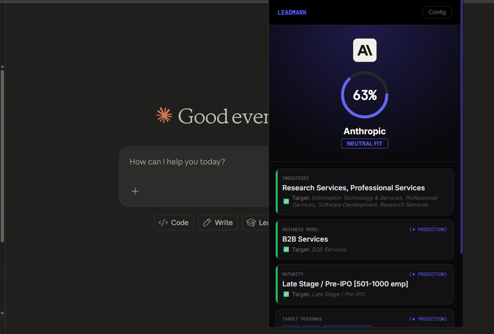
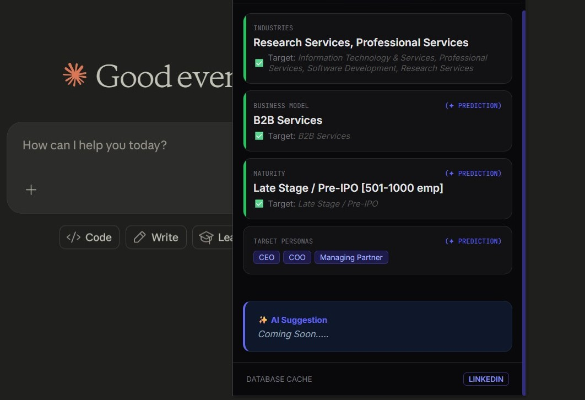
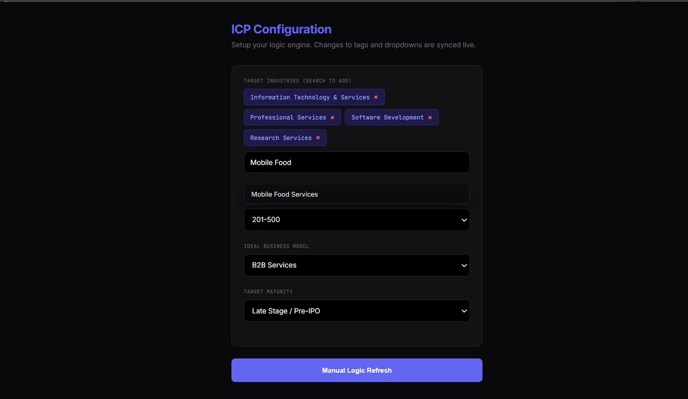
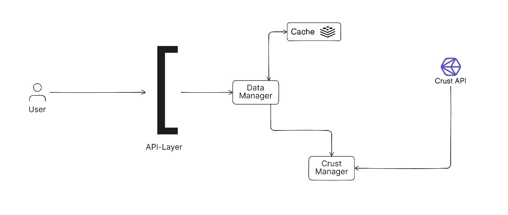

# Leadmark

**Real-time company scoring for B2B sales teams — know which accounts matter before you dial.**

[](https://nodejs.org)
[](https://www.typescriptlang.org)
[](https://developer.chrome.com/docs/extensions/)
[](https://upstash.com)
[](https://expressjs.com)

## What is this?

Leadmark is a browser extension that instantly evaluates any company against your ideal customer profile (ICP). While you're researching a prospect on their website, Leadmark pulls real-time company data—funding stage, employee count, industry, business model, target personas—and scores them against your custom criteria. No spreadsheets. No manual research. Just a decision score in the extension popup: keep scrolling or pick up the phone.

The extension communicates with a Node.js backend that orchestrates data from Crustdata's B2B company database and caches results to keep everything fast. Data-driven GTM teams can configure their ICP once, then let Leadmark filter the noise.

## How it works in 60 seconds

1. **Configure your ICP** – Define target industries, business models, maturity stages in the settings page
2. **Visit any company website** – Leadmark identifies the domain automatically
3. **Get a real-time score** – Backend looks up company data from Crustdata, enriches it with predictive insights, scores it against your criteria
4. **Act on the intel** – See the company logo, employee range, industries, business model, likely buyer personas, and a direct LinkedIn link
5. 
- *PopUP*

<table>
  <tr>
    <td width="50%"></td>
    <td width="50%"></td>
  </tr>
</table>

- *Config*
  



## Key Features

- **Instant company scoring** – 0-100% fit score based on your ICP logic, displayed before you finish loading the about page
- **Smart company enrichment** – Predicts business model and target personas from industry data even when direct data is sparse
- **Configurable matching logic** – Target specific industries, company sizes, and maturity stages; auto-complete from Crustdata's verified industry taxonomy
- **Fast repeat lookups** – 24-hour Redis cache on every score keeps latency sub-second on previously analyzed companies
- **Visual match indicators** – Green for fit, gray for neutral; instantly see which ICP dimensions match
- **Lightweight data fetching** – Rate-limited backend (100 req/min) prevents abuse and keeps infrastructure costs predictable
- **Real-time attribution** – Badge shows whether data came from cache or live Crustdata API

## Architecture



## Component breakdown:

- **Extension (popup.js)**: Extracts domain from active tab, POST request to backend with user's stored ICP settings, renders score UI in real-time
- **Backend (Express/TypeScript)**: Route handler validates domain + settings, orchestrates cache check → Crustdata API call → enrichment → scoring
- **Cache Layer (Upstash Redis)**: Stores full company profiles with 24-hour TTL; hits Redis before Crustdata to reduce costs and latency
- **Enrichment Engine (enrichPredictor.ts)**: Predictive model that infers business model and target personas using frequency analysis from company's industry list and ML rules tied to maturity stage
- **Scoring Algorithm (score.ts)**: Compares company attributes (industries, employee range, maturity) to user's ICP settings; weighted average normalized to 0-100%

## Environment Variables

| Variable | Purpose | Example |
|----------|---------|---------|
| `UPSTASH_REDIS_REST_URL` | Redis cache endpoint (Upstash serverless) | `https://XXX.upstash.io` |
| `UPSTASH_REDIS_REST_TOKEN` | Redis authentication token | `AYYXxxxxx...` |
| `CRUST_URL` | Crustdata API base URL | `https://api.crustdata.com` |
| `CRUST_TOKEN` | Crustdata API key (Bearer token) | `sk_live_XXX...` |
| `CRUST_X_VERSION` | Crustdata API version header | `2024-01` |

## Tech Stack

| Layer | Technology | Why |
|-------|-----------|-----|
| **Frontend** | Vanilla JS, Chrome Extension API | Zero dependencies, instant load, strict CSP compliance |
| **Backend** | Express.js, TypeScript | Type safety for data contracts, lightweight HTTP server |
| **Cache** | Redis (Upstash) | Sub-millisecond reads, managed without ops burden |
| **Data** | Crustdata B2B API | 50M+ company profiles, verified employee counts, industry classifications |
| **Rate Limiting** | express-rate-limit | Protect backend and Crustdata quota; 100 req/min per IP |
| **Validation** | Zod | Runtime schema validation on incoming requests |
| **HTTP** | Axios | Promise-based HTTP client for Crustdata requests |

## Getting Started

### Prerequisites

- **Node.js** 18+ 
- **npm** 9+
- **Chrome** 88+ (extension environment)
- **Crustdata API key** (sign up at [crustdata.com](https://crustdata.com))
- **Upstash Redis account** (serverless Redis, 10,000 free requests/day at [upstash.com](https://upstash.com))

### Installation

1. **Clone the repository**
   ```bash
   git clone https://github.com/yourusername/leadmark.git
   cd leadmark
   ```

2. **Install backend dependencies**
   ```bash
   cd core
   npm install
   ```

3. **Set up environment variables**
   ```bash
   # core/.env
   UPSTASH_REDIS_REST_URL=https://YOUR_UPSTASH_URL
   UPSTASH_REDIS_REST_TOKEN=YOUR_UPSTASH_TOKEN
   CRUST_URL=https://api.crustdata.com
   CRUST_TOKEN=sk_live_YOUR_TOKEN
   CRUST_X_VERSION=2024-01
   ```

4. **Start the backend server**
   ```bash
   npm start
   ```
   Server runs on `http://localhost:3000`. Verify with `curl http://localhost:3000/health`

5. **Load the extension in Chrome**
   - Open Chrome and navigate to `chrome://extensions/`
   - Enable "Developer mode" (toggle in the top-right)
   - Click "Load unpacked"
   - Select the `extension/` folder from this repo
   - The Leadmark icon will appear in your toolbar

6. **Configure your ICP**
   - Click the Leadmark icon in Chrome
   - Click "Config"
   - Add target industries (search is auto-completed from Crustdata's taxonomy)
   - Set business model, employee range (maturity stage), and other criteria
   - Click "Update Logic Engine" to save

7. **Test it**
   - Visit any company website (e.g., https://stripe.com)
   - Click the Leadmark icon
   - You should see a score within 1–2 seconds

### API Endpoints

**POST /score**
```json
{
  "domain": "stripe.com",
  "settings": {
    "industries": ["financial-services", "payment-processing"],
    "maturity_stage": "Late Stage / Pre-IPO",
    "business_model": "B2B Tech / SaaS",
    "e_c_r": "1000+"
  }
}
```
Response:
```json
{
  "score": 87.5,
  "name": "Stripe",
  "logo": "https://...",
  "linkedin": "https://linkedin.com/company/stripe",
  "e_c_r": "1000+",
  "industries": ["financial-services", "payment-processing"],
  "enriched_insights": {
    "maturity_stage": "Late Stage / Pre-IPO",
    "business_model": "B2B Tech / SaaS",
    "target_personas": ["VP Engineering", "CTO", "CFO"],
    "tech_adoption_propensity": "High"
  },
  "cached": false
}
```

**POST /autocomplete**
```json
{
  "field": "basic_info.industries",
  "query": "SaaS",
  "limit": 15
}
```
Returns array of industry suggestions from Crustdata.

**GET /health**
Readiness check. Returns `{ "status": "ok", "time": "2024-04-29T..." }` if backend is running.

## Scoring Logic

The scoring algorithm is a weighted match between company attributes and your ICP settings:

```
Score = (Attributes Matched / Total Attributes Configured) × 100
```

Attributes checked:
- **Industries** – Partial credit if any of the company's industries are in your target list
- **Maturity Stage** – Full match if employee count range matches your target (Seed, Early Stage, Growth, Mid-Market, Late Stage, Enterprise)
- **Business Model** – Full match on business model type (B2B Tech/SaaS, B2C Consumer, Manufacturing, etc.)
- **Employee Count Range** – Implicit in maturity stage match
- **Tech Adoption Propensity** – Inferred from business model (SaaS/B2C = High, Manufacturing/Energy = Low, otherwise Medium)

Example: If you set 3 ICP criteria (industries, maturity stage, business model) and a company matches 2 of them, the score is `(2 / 3) × 100 = 66.7%`.

## Data Enrichment

The extension doesn't just look up raw company data—it makes predictions:

- **Maturity Stage** – Inferred from employee count range using standard startup stage bands (1–10 employees = Seed, 11–50 = Early Stage Series A, etc.)
- **Business Model** – Derived from frequency analysis across the company's industry list (e.g., if 3 of 4 industries map to "B2B Tech", that's the predicted business model)
- **Target Personas** – Top 3 personas from industry data (e.g., if in FinTech, likely buyers are CFO, VP Finance, Chief Risk Officer)
- **Tech Adoption** – Heuristic rule-set based on business model (SaaS/B2C = High, Manufacturing/Energy = Low)

This enrichment happens server-side using the `enrichPredictor` module, keeping the extension UI fast.

## Caching Strategy

Every company lookup is cached in Redis for 24 hours. On cache hit, response latency drops from ~500ms to ~10ms:

- **Cache miss** → Call Crustdata API → Parse response → Store in Redis → Return to extension
- **Cache hit** → Retrieve from Redis → Score against ICP settings → Return to extension

The cache stores the full company profile (name, logo, industries, employee count, LinkedIn, basic info), so repeat lookups avoid Crustdata API costs entirely.

## Rate Limiting

The backend enforces a **100 requests per minute per IP** limit using `express-rate-limit`. This prevents:
- Accidental DoS from browser extensions on shared office networks
- Runaway requests if the extension UI has a bug
- Cost overruns on Crustdata API consumption

If you hit the limit, you'll receive HTTP 429 with a retry-after header.

## Building for Production

1. **Backend deployment** – Use any Node.js host (Vercel, Railway, Render, AWS Lambda)
   ```bash
   npm run build  # if TypeScript compilation step exists
   npm start
   ```

2. **Extension distribution** – Package with `npm run build` (creates ZIP for Chrome Web Store)
   - Follow [Chrome Web Store publishing guide](https://developer.chrome.com/docs/webstore/publish/)
   - Set extension's backend URL in code or inject it via manifest

3. **Secrets management** – Use platform-specific secret stores:
   - Render / Railway: Environment variable panels
   - AWS Lambda: Secrets Manager or parameter store
   - Never commit `.env` files

## What's Next / v2 Roadmap

- **AI-powered recommendations** – "Consider this SDR list" based on ICP fits across 100+ recent lookups
- **Bulk import** – Upload a CSV of company domains, get a scored list with sort/filter options
- **Slack integration** – Post high-fit companies to a dedicated Slack channel in real-time
- **ICP templates** – Pre-built ICP configs for common verticals (SaaS PLG, Enterprise Sales, FinTech, etc.)
- **Advanced enrichment** – Predict funding round, growth rate, technology stack from Crustdata signals
- **Multi-user team settings** – Sales ops define global ICP; reps see team ICP when browsing
- **Predictive lead scoring** – Model scores companies on conversion probability, not just fit
- **Chrome Web Store publishing** – Move from sideload to discoverable extension

## Built With

**Leadmark runs on data powered by [Crustdata](https://crustdata.com)**. We pull real-time company intelligence—verified employee counts, funding information, industry classifications, and organizational structure—from their B2B platform. This is the factual backbone that makes ICP scoring trustworthy.

## License

ISC

---

**Made by [Saish Mungase](https://github.com/saish-mungase)**

Questions? Open an issue. Contributions welcome.
